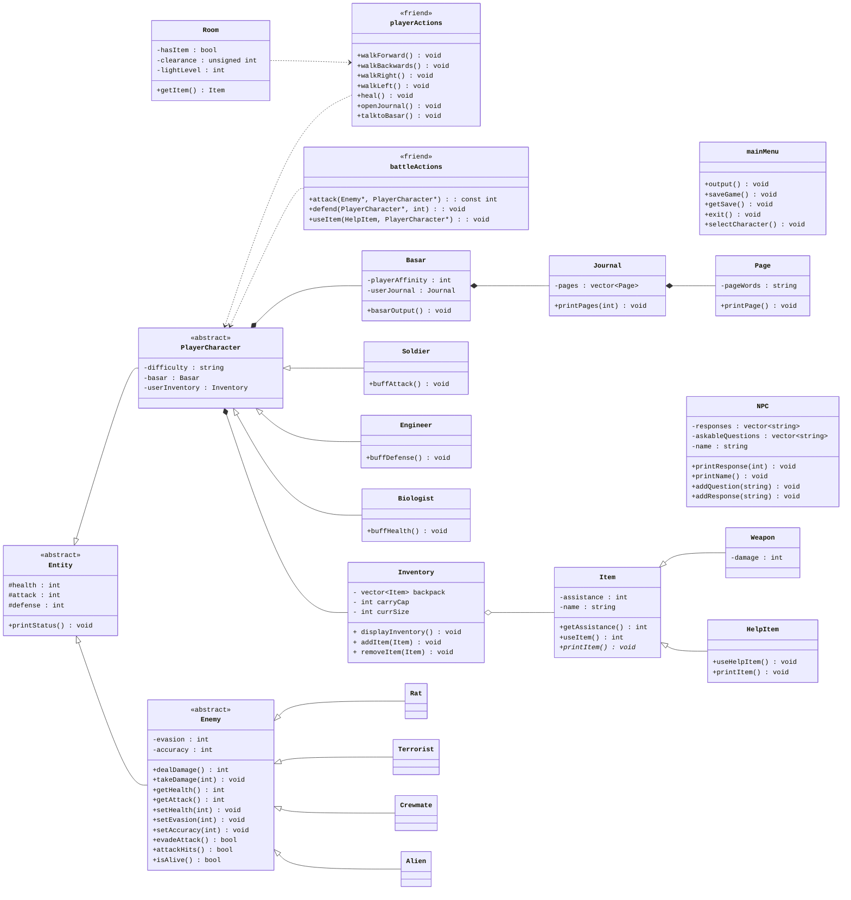
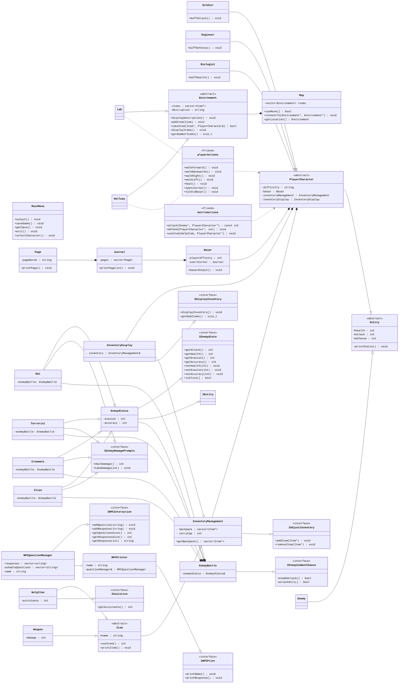

# dÆRA
 
_Developed by:_ [Sydney Hilton](https://github.com/Sydnyepie), [Youssef Adam](https://github.com/atxm), [Jason Lee](https://github.com/jalee314), [Mario Koa Miranda](https://github.com/KoaMiranda)  

## Project Description
 > **_Maneuver your way through the chaos of ad-Dæra, an Egyptian space station left in disarray after an unidentified organism breaches containment._**

The developers all share the desire to develop a compelling and immersive narrative where _you_ choose your story.  
The player will interact with several non-playable characters (NPCs)—including the AI that controls the station—through various dialogue options.
This project provides a science-fiction horror experience in the form of a text-based roleplaying video game.  
It is being developed via the language C++.

| Input                                                                        | Output                                                                                      |
| :--------------------------------------------------------------------------: |    :-----------------------------------------------------------------------------------:    |
| Player chooses character class                                               | Player receives information regarding chosen class                                          |
| Player saves game to preserve progress                                       | Player receives text file containing save info                                              |
| Player loads save file from local files                                      | Player is loaded back to where they saved from                                              |
| Player makes choice based on options given                                   | Terminal outputs pre-determined text for the given choice                                   |
| Player inputs text to battle enemies                                         | Terminal prints either a victory or defeat screen depending on the situation                |
| Player chooses to drop item from inventory                                   | Item is removed from player inventory and the result is outputted in the terminal           |
| Player interacts with **Basar** to receive instructions through the terminal | **Basar** returns a message in the terminal                                                 |
| Player equips items found during the game                                    | Player stats are changed and shown to the player in the terminal                            |
| Player looks inside journal item                                             | Terminal outputs hints on what needs to be done next, and expands on the lore of the story  |

A [project board](https://github.com/orgs/cs100/projects/314/views/1) has been set up to streamline the development process.
## User Interface Specification
### Navigation Diagram

Our navigation diagram shows all the options the players have once in the game. All users will start at the home screen, from which they will have the option to load up a save file or start a new game. At that point, the user will have options to open an inventory menu or open a menu to interact with Basar. The user will also randomly encounter enemies, from which they can either win or lose the battle.

### Screen Layouts
  
This chart detailing expected user interface layouts is present above. Users can expect to see a main menu upon executable launch and, when starting a new game, a description of the in-universe lore before prompted to create their character. After this, the game begins and the program will provide the user with information regarding what they can do to progress.

## Class Diagram

## Updated Class Diagram

The game starts off with the `MainMenu` class that allows the user to start their game, whether it be from a save file or from the start which involves difficulty selection. This is also the class that allows for exiting and saving.

The primary class in this game is the `Entity` class which contains the `health`, `attack`, and `defense` private members as well as the `printStatus()` function. This class acts as a parent for the subclasses of `Enemy` and `PlayerCharacter` which, along with this class, are both abstract classes.

The `PlayerCharacter` class has the 3 options for the character type (i.e., `Soldier`, `Engineer`, and `Biologist`) as subclasses. This class (as well as its derived forms) now introduce the `difficulty`, `Inventory`, and `Basar` private member variables.

The `PlayerCharacter` class includes the mention of an `Inventory` class which keeps track of all of the items in the inventory including the capacity and current size. This class has functions that allow the user to add items, remove items, and display the inventory.

The `Inventory` class also includes members of the `Item` class which includes `assistance` (i.e., the number of damage added or health gained) and the name of the `Item`. This class also includes the pure virtual function that prints the item, grabs the assistance amount, and uses the item. Its derived classes include the `Weapon` and `HelpItem` classes which have the implementation of the functions `printItem()` and `useItem()` and `damage()` member functions respectively.

The `PlayerCharacter` class also makes use of the `Basar` class, the latter being compositionally related to the former in that the user will have access to this particular object that serves as both a fictional AI assistant with hard-coded dialogue options and responses (dependent on the `playerAffinity` which is, in turn, dependent on the dialogue options the user chooses) and as the accessor for the player’s journal, as implemented in the `Journal` class.

The `Journal` class is made of a vector of `Page` objects, the latter class also being compositionally related due to its only implementation as a member variable for the former. `Journal` also possesses a `printPage(int)` function that will make use of the `printPage()` function in the `Page` class.

As a friend to the `PlayerCharacter` class, the `battleActions` class controls any of the combat actions the player can take like doing damage, defending, or using an item.

Similarly, the `playerActions` class is another friend of the `PlayerCharacter` class that allows the user to move around (left, right, back, or forward), heal, or make use of Basar (i.e., access the journal and/or speak with the AI assistant itself).

The `NPC` class includes all the NPC-specific list of responses, NPC name, and list of questions the NPC will answer. This class has functions that allow one to print the NPC's name and response as well as add new questions and responses for the NPC to answer to or ask.

Finally is the `Enemy` class derived from the `Entity` class that contains the subclasses of our common enemies of `Rat`, `Terrorist`, `Crewmate`, and `Alien` classes. All of these classes include a `health`, `attack`, `accuracy`, and `evasion` stat on top of a `dealDamage()`, `takeDamage(int)`, and `printStatus()` function. In this class, the `printStatus()` function just prints the enemy’s current health. As for the `dealDamage()` and `takeDamage(int)` functions, these deal with how much damage the enemy does and how much damage the enemy takes respectively.
The `Environment` is an abstract class that handles the locations that the player will move through during the game. It contains a description `string`, vector of `Item` objects, and methods to list and take items from the `Environment`. Classes like `Hallway`, `Lab`, and others will inherit from `Environment` and implement methods specific to those rooms.

The `Map` class contains all the `Environment`-child classes and arranges them into a map that the player will move through. The `Map` class contains a vector of `Environment` objects and an adjacency matrix that handles the connections between the rooms. The methods include `canMove()` which deduces whether the player made a valid movement command, a `connectTo()` method that creates connections or "doors" between rooms, and `getLocation()` which returns the room the player is currently in.  

# SOLID Principles added

{Sydney}
One update we made to our class diagram was the change to conform to the Open-Closed Principle was the creation of our Entity class. This creation for this class allowed for more entities able to be created in case we wanted to expand our game. This means our code was improved by allowing for easier scalability.
 
Another change we made to our class diagram was the change meant to apply the Single responsibility principle. Our change was removing the changeWeapon function from the Weapon class and instead letting that be managed outside of the class. This allowed for our code to require less changes and less work needing to be done for every Weapon object made throughout the game.
 
 
{Jason}
 
Within my inventory class, I implemented SRP and ISP. Originally, I had one single Inventory classes handling all the responsibilities of my inventory. I split my Inventory class into two classes, InventoryManagement and InventoryDisplay, inventorymanagement controls the responsibility of adding and removing items, and inventoryDisplay controls the responsibility of actually displaying the inventory. They inherit from an AdjustInventory interface and a DisplayInventory interface respectively.  This change helped me make my inventory more scalable and flexible; if I ever make a change to my inventory management logic, I know that it won’t affect my inventory display logic. 

 

I also have an item class in which I implemented ISP, and LSP.  I have an abstract item class, with a derived helpItem class and Weapon class. helpItem has an assistance private member that would basically do something to the player character, which the weapon doesn’t have, so I used an interface and inherited that into my helpItem class so that I don’t have weapon with a getAssistance function that doesn’t do anything. Also, I made sure that my derived classes have the same functionality when replacing any instances of item in the code, such as in the inventory class. It also kind of follows SRP, I didn’t see the need to split the Item class up into multiple classes, cause I thought the methods all referred to the functionality of the items. These changes helped me write better code by making it cleaner and more maintainable, and makes sure that expected behavior is preserved across any subclass instances. 

 

I implemented SRP and ISP to my NPC class.  Like the inventory class, I originally had a single NPC class, and that got split up into NPCPrinter and NPCQuestionManager, both inheriting from a NPCPrint interface and NPCInteraction interface. NPCPrinter controls the output functions related to the NPC, and NPCQuestionManager controls the questions and response logic from our npcs. Like the inventory class, this made my NPC class a lot more scalable and flexible; If I make changes to one class, I can be confident that the other class won’t be messed with, and I’d be able to track errors a lot easier. The interfaces also made sure that each class only has things related to its role.

 
Lastly, I made changes to my Enemy Class, implementing SRP ISP and LSP. I separated my one Enemy class into three classes, EnemyBattle and EnemyStatus, EnemyBattle deals with chance events in combat and EnemyStatus deals with updating the stats of the enemy. I have three implemented interfaces, IEnemyState, IEnemyCombatChance, and IEnemyDamage. IEnemyState is used by EnemyStatus, IEnemyCombatChance is used by EnemyBattle, and IEnemyDamage is used directly by the subclasses that represent the actual enemies to fight. For LSP, all my different enemies that inherit from the Enemy class serve the same functionality and are interchangeable with any instances of an Enemy object within the code. The benefits that these changes are the added scalability and flexibility of course. If I plan on adding any more enemies in the future, these principles streamline that process and make sure each new class will follow the same fundamental interface.
 
 
{Mario}
 
To anticipate more types of rooms being added as we develop our story, I decided to change the Environment class to an abstract class. Originally my plan was to have a single "room" class that would simply change its description and functions depending on whether or not it was a lab or an escape pod etc. The player would need different options and items to interact with depending on the room they were in. But as I learned about the SOLID principles, particularly the Open-closed principle, I decided to make Environment an abstract class that would never need to be changed as more room types were added. Specifically, the methods inside Environment (like description, addItem, etc) apply to all future room types and won't need to be changed. And any number of new room types could be added without issue.

 > ## Final deliverable
 > All group members will give a demo to the reader during lab time. ou should schedule your demo on Calendly with the same reader who took your second scrum meeting. The reader will check the demo and the project GitHub repository and ask a few questions to all the team members. 
 > Before the demo, you should do the following:
 > * Complete the sections below (i.e. Screenshots, Installation/Usage, Testing)
 > * Plan one more sprint (that you will not necessarily complete before the end of the quarter). Your In-progress and In-testing columns should be empty (you are not doing more work currently) but your TODO column should have a full sprint plan in it as you have done before. This should include any known bugs (there should be some) or new features you would like to add. These should appear as issues/cards on your Project board.
 > * Make sure your README file and Project board are up-to-date reflecting the current status of your project (e.g. any changes that you have made during the project such as changes to your class diagram). Previous versions should still be visible through your commit history. 
 
 ## Screenshots
 > Screenshots of the input/output after running your application
 ## Installation/Usage
 > Instructions on installing and running your application
 ## Testing
 > How was your project tested/validated? If you used CI, you should have a "build passing" badge in this README.
 
