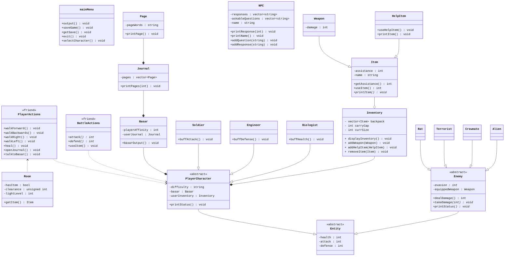

# dÆRA
 
_Developed by:_ [Sydney Hilton](https://github.com/Sydnyepie), [Youssef Adam](https://github.com/atxm), [Jason Lee](https://github.com/jalee314), [Mario Koa Miranda](https://github.com/KoaMiranda)  

## Project Description
 > **_Maneuver your way through the chaos of ad-Dæra, an Egyptian space station left in disarray after an unidentified organism breaches containment._**

The developers all share the desire to develop a compelling and immersive narrative where _you_ choose your story.  
The player will interact with several non-playable characters (NPCs)—including the AI that controls the station—through various dialogue options.
This project provides a science-fiction horror experience in the form of a text-based roleplaying video game.  
It is being developed via the language C++.

| Input                                                                        | Output                                                                                      |
| :--------------------------------------------------------------------------: |    :-----------------------------------------------------------------------------------:    |
| Player chooses character class                                               | Player receives information regarding chosen class                                          |
| Player saves game to preserve progress                                       | Player receives text file containing save info                                              |
| Player loads save file from local files                                      | Player is loaded back to where they saved from                                              |
| Player makes choice based on options given                                   | Terminal outputs pre-determined text for the given choice                                   |
| Player inputs text to battle enemies                                         | Terminal prints either a victory or defeat screen depending on the situation                |
| Player chooses to drop item from inventory                                   | Item is removed from player inventory and the result is outputted in the terminal           |
| Player interacts with **Basar** to receive instructions through the terminal | **Basar** returns a message in the terminal                                                 |
| Player equips items found during the game                                    | Player stats are changed and shown to the player in the terminal                            |
| Player looks inside journal item                                             | Terminal outputs hints on what needs to be done next, and expands on the lore of the story  |

A [project board](https://github.com/orgs/cs100/projects/314/views/1) has been set up to streamline the development process.
## User Interface Specification
### Navigation Diagram

Our navigation diagram shows all the options the players have once in the game. All users will start at the home screen, from which they will have the option to load up a save file or start a new game. At that point, the user will have options to open an inventory menu or open a menu to interact with Basar. The user will also randomly encounter enemies, from which they can either win or lose the battle.

### Screen Layouts
  
This chart detailing expected user interface layouts is present above. Users can expect to see a main menu upon executable launch and, when starting a new game, a description of the in-universe lore before prompted to create their character. After this, the game begins and the program will provide the user with information regarding what they can do to progress.

## Class Diagram

 
 > ## Phase III
 > You will need to schedule a check-in for the second scrum meeting with the same reader you had your first scrum meeting with (using Calendly). Your entire team must be present. This meeting will occur on Zoom and should be conducted by Wednesday of week 8.
 
 > BEFORE the meeting you should do the following:
 > * Update your class diagram from Phase II to include any feedback you received from your TA/grader.
 > * Considering the SOLID design principles, reflect back on your class diagram and think about how you can use the SOLID principles to improve your design. You should then update the README.md file by adding the following:
 >   * A new class diagram incorporating your changes after considering the SOLID principles.
 >   * For each update in your class diagram, you must explain in 3-4 sentences:
 >     * What SOLID principle(s) did you apply?
 >     * How did you apply it? i.e. describe the change.
 >     * How did this change help you write better code?
 > * Perform a new sprint plan like you did in Phase II.
 > * You should also make sure that your README file (and Project board) are up-to-date reflecting the current status of your project and the most recent class diagram. Previous versions of the README file should still be visible through your commit history.
 
> During the meeting with your reader you will discuss: 
 > * How effective your last sprint was (each member should talk about what they did)
 > * Any tasks that did not get completed last sprint, and how you took them into consideration for this sprint
 > * Any bugs you've identified and created issues for during the sprint. Do you plan on fixing them in the next sprint or are they lower priority?
 > * What tasks you are planning for this next sprint.

 
 > ## Final deliverable
 > All group members will give a demo to the reader during lab time. ou should schedule your demo on Calendly with the same reader who took your second scrum meeting. The reader will check the demo and the project GitHub repository and ask a few questions to all the team members. 
 > Before the demo, you should do the following:
 > * Complete the sections below (i.e. Screenshots, Installation/Usage, Testing)
 > * Plan one more sprint (that you will not necessarily complete before the end of the quarter). Your In-progress and In-testing columns should be empty (you are not doing more work currently) but your TODO column should have a full sprint plan in it as you have done before. This should include any known bugs (there should be some) or new features you would like to add. These should appear as issues/cards on your Project board.
 > * Make sure your README file and Project board are up-to-date reflecting the current status of your project (e.g. any changes that you have made during the project such as changes to your class diagram). Previous versions should still be visible through your commit history. 
 
 ## Screenshots
 > Screenshots of the input/output after running your application
 ## Installation/Usage
 > Instructions on installing and running your application
 ## Testing
 > How was your project tested/validated? If you used CI, you should have a "build passing" badge in this README.
 
